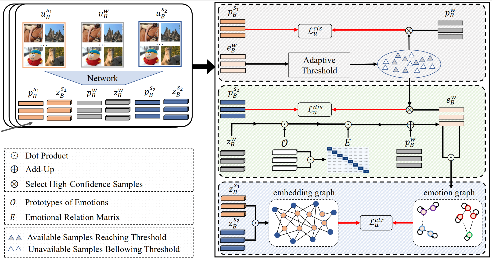
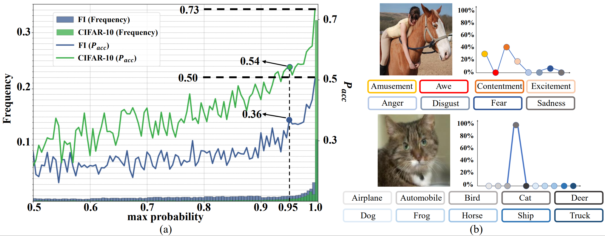

<div align="center">

## **S2-VER**: Semi-Supervised Visual Emotion Recognition

<a href="https://pytorch.org/get-started/locally/"></a>
[](https://eccv2022.ecva.net/)
[](https://github.com/exped1230/S2-VER/blob/main/LICENSE)
  
</div>

This is the official implement of our **ECCV 2022** paper [S2-VER: Semi-Supervised Visual Emotion Recognition](https://www.ecva.net/papers/eccv_2022/papers_ECCV/papers/136970483.pdf).

<p align="center">

    <h4 align="center">Overview of S2-VER</h4>
</p>

## Abstract
Visual Emotion Recognition (VER), which plays an important role in various applications, has attracted increasing attention of researchers. Due to the ambiguous characteristic of emotion, it is hard to annotate a reliable large-scale dataset in this field. An alternative solution is Semi-Supervised Learning (SSL), which progressively selects high-confidence samples from unlabeled data to help optimize the model. However, it is challenging to directly employ existing SSL algorithms
in VER task. On the one hand, compared with object recognition, in VER task, the accuracy of the produced pseudo labels for unlabeled data drops a large margin. On the other hand, the maximum probability in the prediction of the unlabeled sample is difficult to reach the fixed threshold, which leads to few unlabeled samples can be leveraged. Both of them would induce the suboptimal performance of the learned model. To address these issues, we propose S2-VER, the first SSL algorithm for VER, which consists of two components. The first component, reliable emotion label learning, which aims to improve the accuracy of pseudo-labels. In detail, it generates smoothing labels by computing the similarity between the maintained emotion prototypes and the embedding of the sample. The second one is ambiguity-aware adaptive threshold strategy that is dedicated to leveraging more unlabeled samples. Specifically, our strategy uses information entropy to measure the ambiguity of the smoothing labels, and then adaptively adjusts the threshold, which is adopted to select high-confidence unlabeled samples. Extensive experiments conducted on six public datasets show that our proposed S2-VER performs favorably against the state-of-the-art approaches.

## Training
To perform S2-VER on your dataset with 1600 labels, run:

```python main.py --epoch 512 --num_train_iter 1024 --num_labels 1600 -bsz 8 --train_data_dir your_train_set_path --test_data_dir your_test_set_path -ds fi -nc 8 --num_workers 4 --gpu 1 --overwrite```

The used datasets are provided in our [homepage](http://47.105.62.179:8081/sentiment/index.html).

## Citation
If you find this code to be useful for your research, please consider citing.
```
@inproceedings{jia2022S2-VER,
  title={S2-VER: Semi-Supervised Visual Emotion Recognition},
  author={Jia, Guoli and Yang, Jufeng},
  booktitle={ECCV},
  year={2022}
}
```
